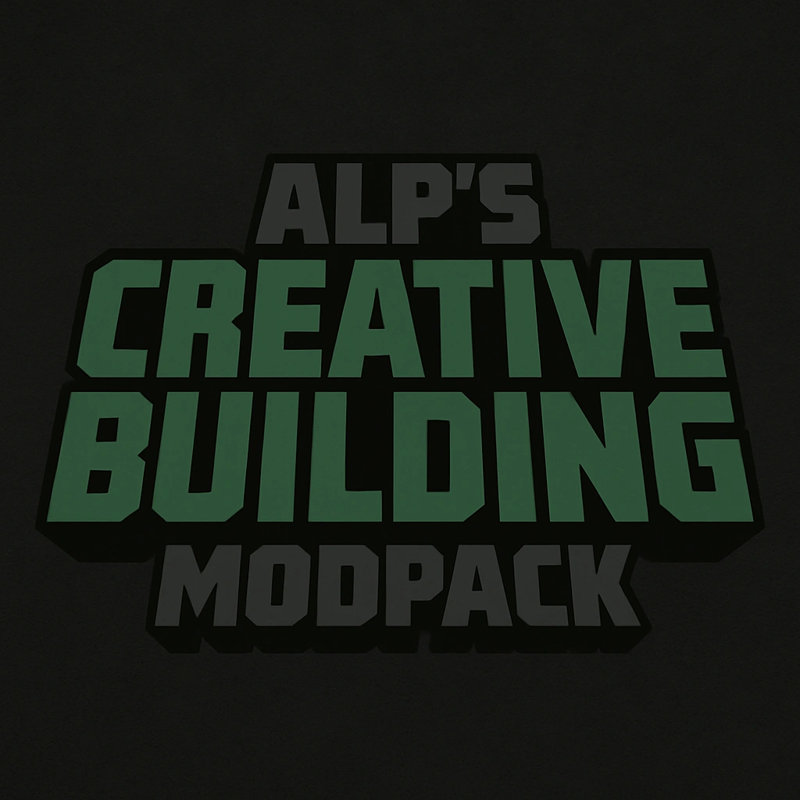

# 🧱 Alp's Creative Building Modpack (Fabric 1.21.5) 🛠️

[](https://fabricmc.net/)
[](LICENSE)
[](https://github.com/KhazP)
[](https://buymeacoffee.com/alpyalayg)
 [Patreon](https://www.patreon.com/cw/KhazP)
 
> **Client-side Fabric 1.21.5 pack focused on performance, visuals (shaders), and building tools. Includes Sodium, Iris, Litematica & more. Vanilla server compatible.**

---

## 📖 Table of Contents

* [Overview](#overview)
* [✨ Core Features](#-core-features)
* [⚙️ Recommended Settings](#️-recommended-settings)
* [🎨 Included Shaders & Resource Packs](#-included-shaders--resource-packs)
* [Recommended Server-Side Plugins](#recommended-server-side-plugins)
* [📦 Included Mods](#-included-mods)
* [🚀 Getting Started](#-getting-started)
* [🤝 Reporting Issues](#-reporting-issues)
* [📄 License](#-license)
* [📞 Contact](#-contact)

---

## Overview

Alp's Creative Building Modpack is a client-side Fabric modpack for Minecraft 1.21.X, meticulously curated to enhance the creative building experience. It focuses on delivering high performance, stunning visuals through shader support, and a comprehensive suite of building tools, all while remaining compatible with vanilla servers. This pack is ideal for builders who want a performance-optimized and visually enriched environment without altering core gameplay mechanics.

---

## ✨ Core Features

* **🚀 Performance:** High FPS via Sodium, Lithium, FerriteCore, Krypton, ImmediatelyFast, Entity Culling, More Culling & other optimizations.
* **✨ Visuals:** Shader support via Iris (Photon Shaders recommended), connected textures (Continuity), dynamic lights (LambDynamicLights), falling leaves, particle effects (Visuality), better grass, capes, Distant Horizons for extended viewing, and more.
* **🛠️ Building Tools:** Schematics via Litematica (with Printer), precise placement/tools via Tweakeroo, Accurate Block Placement, Bridging Mod.
* **💡 Quality of Life:** Mod Menu, BetterF3, Xaero's World Map, improved chat (Chat Patches, More Chat History), better UI elements (Better Command Block UI, OptiGUI), freecam, inventory move (InvMove), sound physics, coordinates display, and many other client-side enhancements.
* **🍦 Client-Side & Vanilla Friendly:** Adds no blocks/items. Use safely on vanilla servers. Includes ViaFabricPlus for compatibility with different server versions.

---

## ⚙️ Recommended Settings

* **Suggested RAM:** 6GB (Allocate 6144MB in your launcher).
* **Note on RAM:** Allocating significantly more RAM (e.g., 10GB+) might negatively impact performance due to Java's garbage collection, unless you are using very high-resolution resource packs alongside this modpack. 6GB is generally sufficient for a smooth experience with the included mods and shaders.

---

## 🎨 Included Shaders & Resource Packs

### Included Shaders:
* Photon Shaders (Recommended)
* Bliss Shaders

### Included Resource Pack:
* Vanilla Mashup (PBR)

---

## Recommended Server-Side Plugins
* Distant Horizons server plugin
* Xaero Map Spigot
* Simple Voice Chat
---

</details>

## 🚀 Getting Started

1.  **Download a Fabric-compatible Launcher:**
    * [Prism Launcher](https://prismlauncher.org/) (Recommended)
    * [Modrinth App](https://modrinth.com/app)
    * [ATLauncher](https://atlauncher.com/)
2.  **Import the Modpack:**
    * Download the `.mrpack` file from the [Modrinth Page](https://modrinth.com/modpack/alps-creative-building-modpack) (link to be added once available).
    * Use your launcher's "Import" or "Add Instance" feature and select the downloaded `.mrpack` file.
3.  **Allocate RAM:** Ensure you have allocated at least 6GB of RAM to the instance in your launcher settings.
4.  **Launch & Play!**

---

## 🤝 Reporting Issues

If you encounter any bugs, compatibility issues, or have suggestions for the modpack, please open an issue on the [GitHub repository Issues page](https://github.com/KhazP/Alps-Creative-Building-Modpack/issues) (assuming this is your repo URL).

---

## 📄 License

This modpack (the compilation of mods and configuration) is licensed under the [MIT License](LICENSE). Individual mods included in the pack are subject to their own licenses.

---

## 📞 Contact

* **GitHub**: [KhazP](https://github.com/KhazP)
* For support with the modpack, please use the GitHub Issues page.

---

## 📦 Included Mods

<details>
<summary>Click to expand the full list of mods (70+)</summary>

```
Accurate Block Placement
AmbientSounds
Better Command Block UI
Better Grassify
Better Highlighting
Better Suggestions
BetterF3
Boxlib
BridgingMod
Capes
Cave Dust
Chat Animation
Chat Heads
Chat Patches
Cherished Worlds
Cloth Config API
Continuity
Controlling
Coordinates Display
CraftPresence
CreativeCore
Cubes Without Borders (cwb)
Dark Graph
Dark Loading Screen
Debugify
Distant Horizons
Dynamic FPS
Entity Culling
Entity Model Features
Entity Texture Features
Fabric API
Fabric Language Kotlin
Falling Leaves
FastQuit
FerriteCore
Forge Config API Port
Freecam
ImmediatelyFast
InvMove (Inventory Move)
Iris Shaders
Krypton
LambDynamicLights
Language Reload
Litematica
Litematica Printer
Lithium
MaLiLib
Main Menu Credits
MixinTrace
Model Fix
Mod Menu
More Chat History
More Culling
No Chat Reports
No Resource Pack Warnings
Not Enough Crashes
OptiGUI
Particle Rain
Puzzle
Reese's Sodium Options
Resourcify
Roughly Enough Resources (RRLS)
Safe Void
Server Pinger Fixer
Show Operator Tab
Sodium
Sodium Extra
Sodium Shadowy Path Blocks
Sound Physics Remastered
Stendhal (Bookshelf API)
Suggestion Tweaker
Tweakeroo
UniLib
ViaFabricPlus
Visuality
Voice Chat (Simple Voice Chat)
Wavey Capes
Xaero's World Map
XaeroZoomout
Remote player waypoints for Xaero's Map
Yet Another Config Lib (YACL)
Your Options Shall Be Respected (YOSBR)
Zoomify
```
